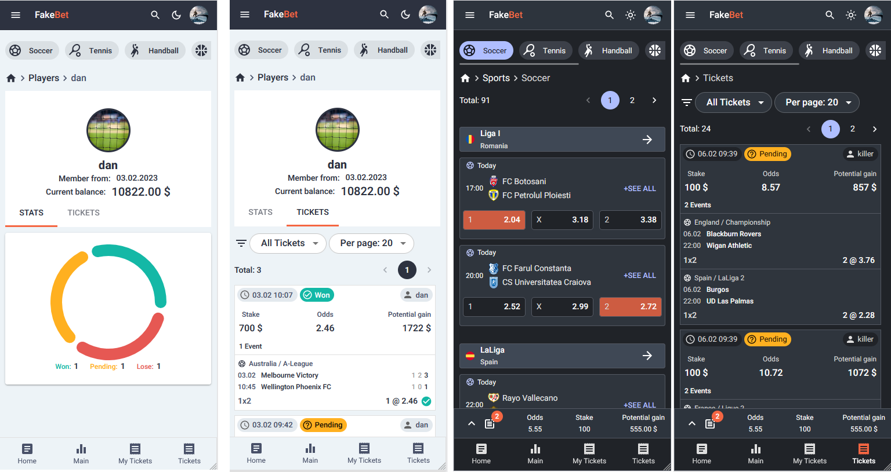

# Fake bet

This is a game app built for fun, that replicates a real sports betting website.
Users can register, and they will receive a fake 10.000$ in their game account, to play around.
The idea is to predict game outcomes without losing money on a real betting agency.
My theory is that is almost impossible to have profit on long term by betting. But you can train here without losing money

### Built with

- React js
- Typescript
- Redux RTK
- MUI
- Styled components
- Vite

### Features

- users can register and place bets, on the actual sports offer that is available on betting agencies.
- all the "tickets" are public, meaning that any user can see the predictions from the other players.
- users can search for any upcoming sport event
- display a page with all the tickets
- a player page where we can see the current balance and the betting history.

### Live site

- [https://fakebet.netlify.app/](https://fakebet.netlify.app/)

### Screenshots

